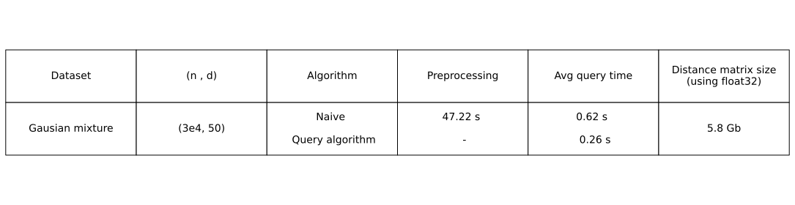
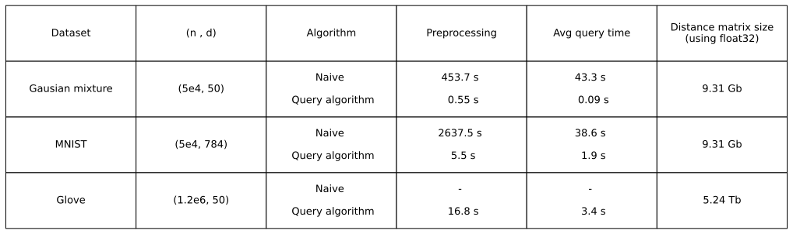
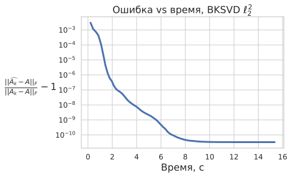
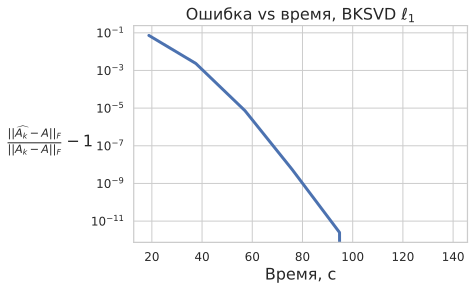
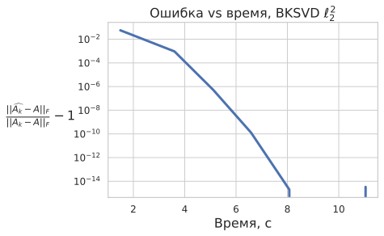

# Алгоритм быстрого умножения вектора на матрицу расстояний

## Идеи

- Быстрые алгоритмы для матриц расстояний в различных метриках
- Randomized Block Krylov Method для частичной задачи на сингулярные числа матрицы расстояний

## Запросы к матрице расстояний

- Пусть имеется датасет $X\in\mathbb{R}^{n\times d}$. 
- Матрица расстояний $A\in\mathbb{R}^{n\times n}$ содержит расстояния $A_{ij}=\rho(x_i,x_j)$, где $\rho(\cdot,\cdot)$ - некоторая метрика.
- Запросом к матрице $A$ будем называть матрично-векторное умножение $Ay,\ y\in\mathbb{R}^n$.
- Запросы позволяют решать численные задачи линейной алгебры без хранения матрицы $A$

## Быстрые запросы к матрице расстояний в $\ell_2^2$ метрике
k-ая координата для query $Ay$, где A - матрица расстояний, может быть найдена следующим образом:

$$
(Ay)_k = \sum_{j=1}^ny_j\|x_k-x_j\|_2^2 = ||x_k||_2^2 \sum_{j=1}^ny_j + \sum_{j=1}^ny_j||x_j||_2^2 - 2\langle x_k, \sum_{j=1}^ny_jx_j  \rangle
$$

## Составим простой query-алгоритм 
1) $v =  \sum_{i=1}^ny_ix_i$

2) $S_1 = \sum_{i=1}^ny_i$ 

3) $S_2 = \sum_{i=1}^ny_i||x_i||_2^2$

4) $\operatorname{ans}(k) = S_1||x_k||_2^2 + S_2 - 2\langle x_k, v\rangle$

## Сложность алгоритма
- Сложность query = $O(nd)$ 

## Сравнение наивного алгоритма запроса с быстрым

**Основная особенность — отсутствие preprocessing**

## Быстрые запросы к матрице расстояний в $l_1$ метрике
$k$-ая координата для query $Ay$, где A - матрица расстояний, может быть найдена следующим образом:

$$
(Ay)_k = \sum_{j=1}^ny_j\|x_k-x_j\|=\sum_{j=1}^n\sum_{i=1}^dy_j|x_{k,i}-x_{j,i}|=\sum_{i=1}^d\sum_{j=1}^ny_j|x_{k,i}-x_{j,i}|
$$

Для каждого признака $i = \overline{1, d}$ введем перестановку $\pi ^ i$, которая соответствует отсортированному в порядке возрастания массиву значений $x_{j,i}$ (по столбцам). Тогда: 

$$
(Ay)_k = \sum_{i=1}^d\sum_{j=1}^ny_j|x_{k,i}-x_{j,i}| = \sum_{i=1}^d\Bigg(\sum_{j \ : \ \pi^i(k) \leqslant \pi^i(j)} y_j(x_{j,i}-x_{k,i})  \quad + \sum_{j \ : \ \pi^i(k) \gt\pi^i(j)} y_j(x_{k,i}-x_{j,i}) \Bigg)
$$

Перегруппируем значения в скобках:

$$
(Ay)_k = \sum_{i=1}^d\Bigg(x_{k,i}\bigg(\sum_{j \ : \ \pi^i(k) \gt\pi^i(j)}y_j \quad- \sum_{j \ : \ \pi^i(k) \leqslant \pi^i(j)} y_j\bigg)\quad + \sum_{j \ : \ \pi^i(k) \leqslant \pi^i(j)}y_jx_{j,i} \quad- \sum_{j \ : \ \pi^i(k) \gt\pi^i(j)} y_jx_{j,i} \Bigg) \\ 
(Ay)_k = \sum_{i=1}^d \bigg(x_{k,i}(S_3 - S_4) + S_2 - S_1 \bigg)
$$

## Сложность алгоритма

- Препроцессинг - поиск перестановок $\pi^i$

- Cложность препроцессинга $O(nd\log n)$

- Cложность query = $O(nd)$

## Сравнение наивного алгоритма запроса с быстрым

## Частичная задача на сингулярные числа

Randomized Block Krylov Method [MM15]:

**Вход:** $A\in\mathbb{R}^{n\times d}$, ошибка $\epsilon\in(0,1)$, ранг $k\leq n,d$

**Выход:** $\widehat{U}_k, \widehat{\Sigma}_k, \widehat{V}_k$

1. $q=\Theta\left(\log(d)/\sqrt{\epsilon}\right)$
2. $\Pi\sim\mathcal{N}(0,1)^{d\times k}$
3. $K:=[A^TA\Pi, (A^TA)^2\Pi, \ldots, (A^TA)^q\Pi]\in\mathbb{R}^{n\times qk}$
4. $K=QR,\ Q\in\mathbb{R}^{n\times qk}$
5. $\widehat{U},\widehat{\Sigma},\widehat{V}\leftarrow \operatorname{SVD}(AQ)$
6. **Вернуть** $\widehat{U}_k, \widehat{\Sigma}_k, Q\widehat{V}_k$

Подробности в [bksvd.py](https://github.com/voorhs/mq-bksvd/blob/main/code/bksvd.py).

## Сходимость

**Теорема (10, 11, 12 из [MM15]).** С вероятностью $0.99$ алгоритм BKSVD возвращает $k$-ранговую аппроксимацию $\widehat{A_k}=\widehat{U}_k\widehat{\Sigma}_k\widehat{V}_k$ такую, что

$$
\begin{align}
\|A-\widehat{A}_k\|_2&\leq (1+\epsilon)\|A-A_k\|_2\\
\|A-\widehat{A}_k\|_F&\leq (1+\epsilon)\|A-A_k\|_F\\
|\sigma_i-\widehat{\sigma}_i|&\leq\epsilon\cdot\sigma_{k+1}^2
\end{align}
$$

Для этого требуется $q=\Theta\left(k/\sqrt{\epsilon}\right)$ запросов к матрице $A$.

**Теорема (1.3 из [BCW22]).** Для $\epsilon>0$ и константы $p\ge1$ найдётся распределение $\mathcal{D}$ матриц $n\times n$ таких, что для $A\sim\mathcal{D}$ любой алгоритм, который хотя с константной вероятностью возвращает вектор $v:$

$$
\|A-Avv^T\|^p_{S_p}\leq(1+\epsilon)\min_{\|u\|_1=1}\|A-Auu^T\|^p_{S_p},
$$

требует $\Omega(1/\epsilon^{1/3})$ запросов к матрице $A$.

##  Gaussian Mixture (24K объектов)

| Время svds                       | 120.7 сек | 77.3 сек  |
| -------------------------------- | --------- | --------- |
| Время постр. dist matrix | 10.55 сек | 17.46 сек |
| Время preproc              | 0.227 сек | -         |
|                                  |  |  |

##  MNIST (15K объектов)

| Время svds                       | 13.95 сек | 11.68 сек  |
| -------------------------------- | --------- | --------- |
| Время постр. dist matrix | 525.2 сек | 819.41 сек |
| Время preproc              | 3.1 сек | -         |
|                                  |  |  |

## Препятствия для ускорения других методов

Просто заменить matvec на query не получится:

- Предобуславливатели: $B\approx A-\sigma I$

- Уравнение коррекции Якоби: $(I-x_jx_j^*)(A-R(x_j)I)(I-x_jx_j^*)t=-r_j$ 

Возможное решение: использовать и запросы, и матрицу расстояний.

## Литература

- [IS22] Indyk, P., Silwal, S.. (2022). *Faster Linear Algebra for Distance Matrices.*

- [MM15] Musco, C., & Musco, C.. (2015). *Randomized Block Krylov Methods for Stronger and Faster Approximate Singular Value Decomposition.*
- [BCW22] Bakshi, A., Clarkson, K., & Woodruff, D.. (2022). *Low-Rank Approximation with $1/ε^{1/3}$ Matrix-Vector Products.*
